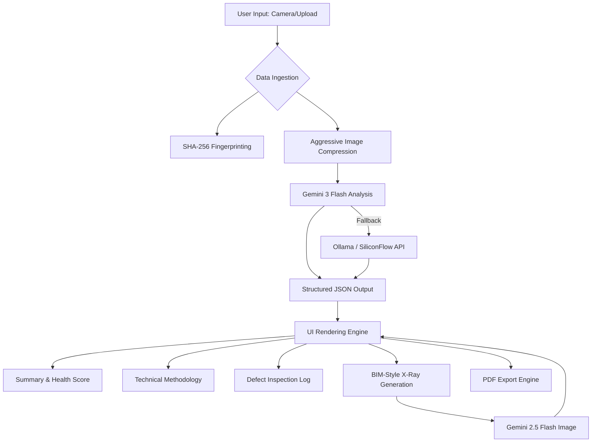

# 🏗️ CivilVision AI: The Digital Blueprint for Structural Intelligence

[](https://reactjs.org/)
[](https://www.typescriptlang.org/)
[](https://tailwindcss.com/)
[](https://ai.google.dev/)
[](https://ollama.ai/)
[](https://vitejs.dev/)

**CivilVision AI** is a production-grade, multi-modal AI ecosystem designed for the modern civil engineer. It bridges the gap between physical site inspections and digital structural analysis, transforming raw visual data into actionable engineering intelligence — wrapped in a stunning glassmorphic UI with real-time animated effects.

---

## ⚡ The Problem vs. The Solution

| The Traditional Site Inspection | The CivilVision AI Blueprint |
| :--- | :--- |
| **Manual Identification:** Subjective and prone to human error. | **Neural Recognition:** Instant, typology-aware element identification. |
| **Fragmented Knowledge:** Flipping through physical IS Codes and manuals. | **Integrated Hub:** 24 core engineering domains at your fingertips. |
| **Invisible Defects:** Hairline cracks and corrosion often overlooked. | **High-Fidelity Scanning:** AI-driven defect detection with severity scoring. |
| **Static Reports:** Hours spent drafting technical documentation. | **Dynamic Reporting:** One-click professional PDF generation with BIM X-Rays. |

---

## 🧠 Intelligence & Architecture

CivilVision AI utilizes a sophisticated dual-engine pipeline. Primary analysis runs through **Google Gemini 3 Flash** with automatic fallback to **Ollama / SiliconFlow** for maximum availability. The frontend features a **Liquid Glass UI** with SVG-based refraction effects and animated gradient backgrounds.

### System Flow Diagram



### Core Architectural Pillars

1.  **Neural Inspection Core:** A specialized system prompt that transforms the AI into a "Senior Lead Structural Engineer," capable of identifying distress in concrete, steel, and pavements with code-compliant remedial actions.
2.  **Structural Health Scoring:** A quantitative 0-100 metric derived from visual distress indicators, providing an immediate assessment of structural integrity.
3.  **Liquid Glass UI:** A GPU-accelerated glossy interface with SVG displacement maps, chromatic aberration effects, and dynamic gradient animations that respond to pointer movement.
4.  **Knowledge Hub V2:** A massive hierarchical database covering 24 engineering domains, from Bridge Engineering to Metro & Tunneling (TBM).

---

## 🛠️ Setup & Installation

### Prerequisites
- Node.js (v18 or higher)
- A Google Gemini API Key or Ollama/SiliconFlow API Key

### 1. Clone the Repository
```bash
git clone https://github.com/rahulcvwebsitehosting/CivilVisAi.git
cd CivilVisAi
```

### 2. Install Dependencies
```bash
npm install
```

### 3. Environment Configuration
Create a `.env` file in the root directory and add your API credentials:
```env
VITE_OLLAMA_BASE_URL=https://api.siliconflow.cn/v1
VITE_OLLAMA_API_KEY=your_api_key_here
OLLAMA_BASE_URL=https://api.siliconflow.cn/v1
OLLAMA_API_KEY=your_api_key_here
GEMINI_API_KEY=your_gemini_api_key_here
```

### 4. Launch the Development Server
```bash
npm run dev
```

### 5. Production Build
```bash
npm run build
npm start
```

---

## 📐 User Interface Layout

| Component | Description | Visual Metaphor |
| :--- | :--- | :--- |
| **The Command Center** | The home screen featuring animated gradient orbs, glassmorphic cards, and pulsating telemetry gauges. | *Liquid Glass Dashboard* |
| **The Inspection Tab** | A high-contrast list of detected defects with severity badges and remedial actions. | *Site Audit Log* |
| **The X-Ray Viewer** | A dedicated section for visualizing internal reinforcement and material layers. | *BIM Section Cut* |
| **The Knowledge Hub** | An editorial-style library with 24 core domains and interactive design tools. | *Engineering Encyclopedia* |
| **The Settings Console** | A comprehensive profile and app customization suite for personal branding. | *System Configuration* |

---

## 🎨 UI Features

- **Animated Gradient Backgrounds:** Dynamic shifting purple/cyan orbs with 20s animation loop
- **Glassmorphism Cards:** Backdrop-filter blur with specular highlights and border glow
- **Shimmer Buttons:** Light-sweep animation on primary CTA elements
- **Pulse Glow:** Breathing light effects on interactive elements
- **Smooth Transitions:** 0.3s ease transitions on hover, focus, and active states
- **Accessibility First:** Respects `prefers-reduced-motion` system setting

---

## 🤝 Connect & Collaborate

Developed with precision by **Rahul Shyam**.

[](https://linkedin.com/in/rahulshyamcivil)
[](https://github.com/rahulcvwebsitehosting)

---

> *"Bridging the gap between structural integrity and digital innovation."*
